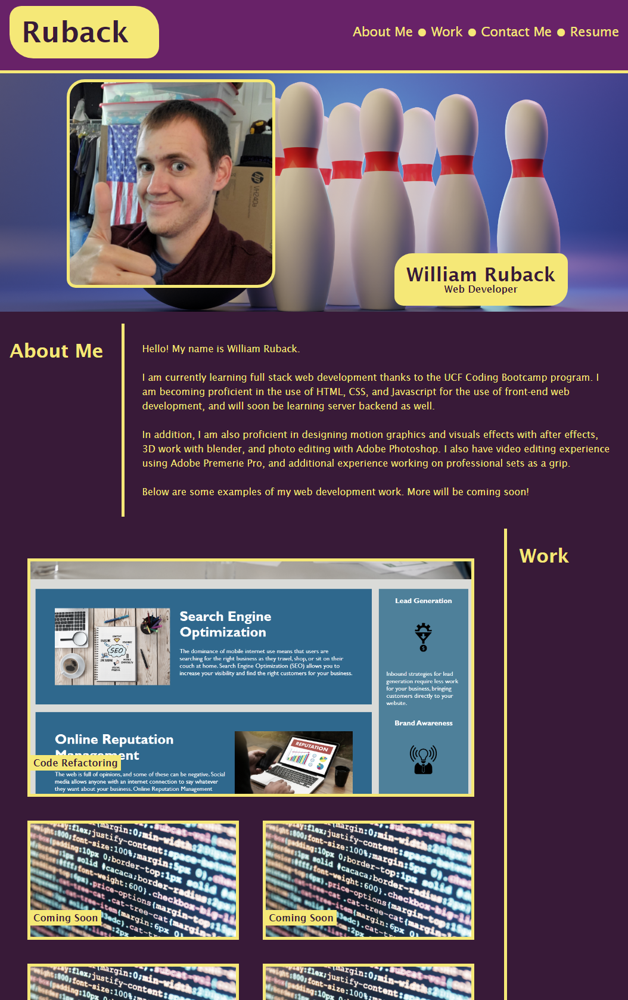
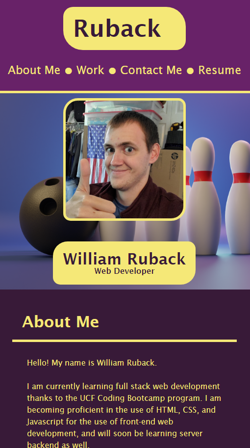

# Practice Portfolio Website

## Description

A homework project for bootcamp to create and design your own portfolio page. This page includes a profile image, an about me section, a work section with button links to portfolio items, and a contacts list. The buttons have a basic glow animation that plays when they are hovered over. The website was also designed to change formatting and scale to be viewed on both desktop and mobile devices.

This page will be updated in the future with additional portfolio items, and with new web development techniques to showcase my abilities.

The current design of this webpage is based on this example:

## Webpage Link

[please click here to view the webpage.](https://wruback.github.io/WR-practice-portfolio-website/)

## Webpage Appearance

Desktop Version:

Modile Version:

